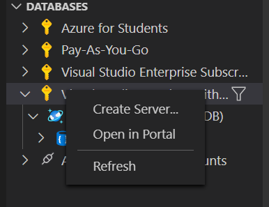
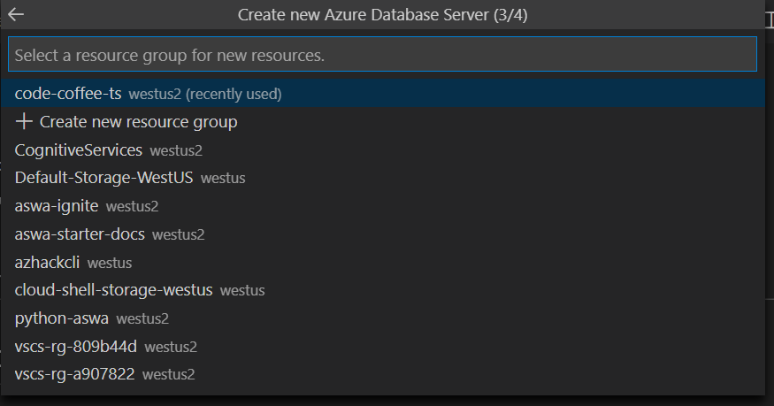
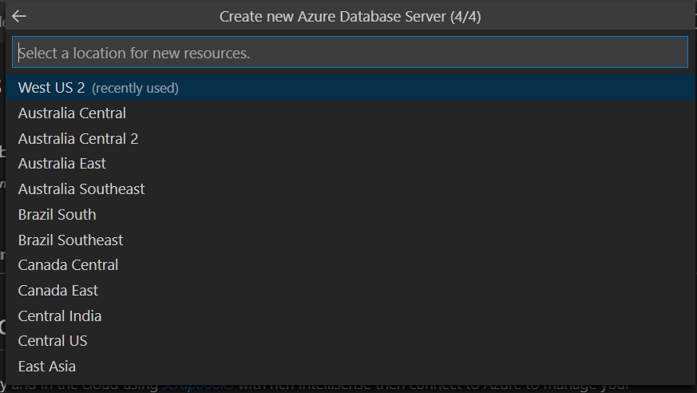
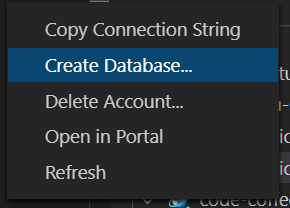
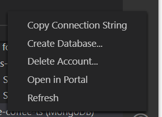
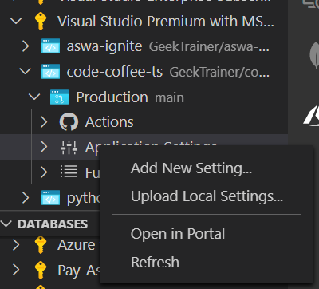

# Setting up the database

With our website created and deployed, it's time to turn our attention to the database. We're going to setup [Azure Cosmos DB](https://azure.microsoft.com/services/cosmos-db/) with a Mongo API, which will behave like Mongo DB. This will allow us to use [Mongoose](https://mongoosejs.com/), a popular data mapping tool, to work with our data in our application.

We need to complete the following steps:

- [Setting up the database](#setting-up-the-database)
  - [Create the server](#create-the-server)
  - [Create the database](#create-the-database)
  - [Configure web app to use database](#configure-web-app-to-use-database)
  - [Explore your live site with data](#explore-your-live-site-with-data)
  - [Next steps and exploring the code](#next-steps-and-exploring-the-code)

## Create the server

In our [getting started](getting-started.md) section we installed the [Azure Databases](https://marketplace.visualstudio.com/items?itemName=ms-azuretools.vscode-cosmosdb) extension. We'll use the extension to create our resources.

1. Click the Azure icon on your toolbar in Azure


2. In the **DATABASES** section, right click on the subscription you wish to use and choose **Create server**



3. In the dialog box, set the following options:

- Server type: Azure Cosmos DB for MongoDB API


- Account name, also known as the name of the server (**choose a unique name**)


- Select the Resource Group which matches the name of the web app you created earlier



- Select the same region you chose earlier



And now we wait while our database account/server is created. This will take a few minutes, so it's the perfect time to take a quick break (which is always important).

## Create the database

With our account created, we need a database. Let's return to the **DATABASES** section in Visual Studio Code and set it up.

- Open your subscription, right click on the account you created earlier and choose **Create database**



- In the dialog, set the name of your database


- In the dialog, set the name of your collection to **tasks** (this is where our data will actually go!)


> **NOTE**: You may receive an error message about Server Discovery being deprecated. You can ignore this message.

- Get the connection string for your Cosmos DB account by right-clicking on the account and choosing **Copy Connection String**



> **IMPORTANT**: Store this connection string somewhere; you'll use it in just a minute.

We're all set with our server resource creation! Now, let's get our connection string and configure our web app to use it.

## Configure web app to use database

Let's configure our web app to use our database! We're going to do this by using a little file called **local.settings.json**. Similar to [dotenv](https://www.npmjs.com/package/dotenv), **local.settings.json** consists of settings you need to run your application but don't want to publish into GitHub. **local.settings.json** integrates with Azure Functions (and in turn Azure Static Web Apps), allowing you to quickly synchronize settings across dev and production.

- In the **api** folder of your application, create a new file named **local.settings.json**
- Copy the following JSON into the new file

```json
{
  "IsEncrypted": false,
  "Values": {
    "AzureWebJobsStorage": "",
    "FUNCTIONS_WORKER_RUNTIME": "node",
    "CONNECTION_STRING": "YOUR_CONNECTION_STRING"
  }
}
```

- Replace the placeholder **YOUR_CONNECTION_STRING** (keeping the quotes) with the connection string you copied earlier.

- Return to the Azure tools by clicking on the Azure icon
- Open your subscription, the name of your web app, and then **Production**
- Right click on **Application Settings** and choose **Upload Local Settings**



This will upload the settings from our **local.settings.json** to our Static Web App. You can open **Application Settings** to see the new values.

## Explore your live site with data

With the database connection string now configured, you can return to your site by right-clicking on it and choosing **Browse**. You can now create tasks and complete them!

## Next steps and exploring the code

With everything setup, the [next step](local-dev.md) is to ensure our development environment is configured and talk a little bit about what our starter includes.
